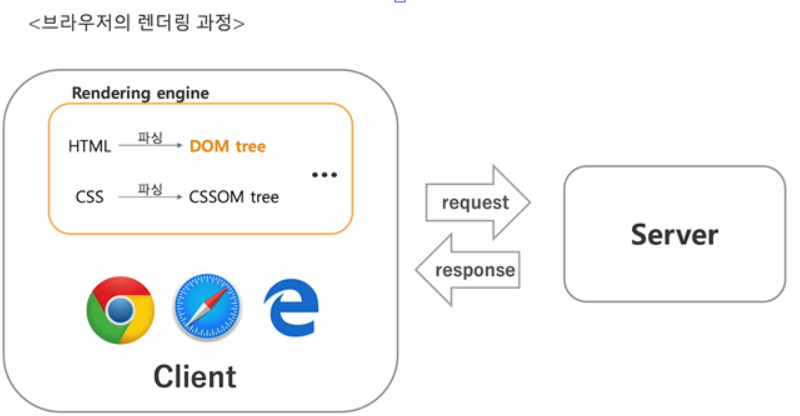
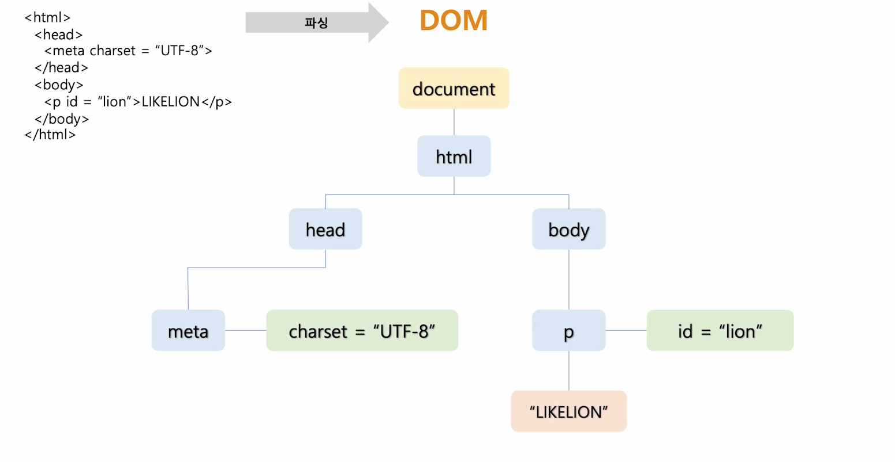

# DOM (Document Object Model )

문서 객체 모델 (The Document Object Model, 이하 DOM ) 은 HTML, XMl 문서의 프로그래밍 interface 이다 DOM 은 문서인 구조화 표현을 제공하며
프로그래밍 언어가 DOM 구조에 접근할 수 있는 방법을 재공하며 그들이 문서 구조, 스타일, 내용 등을 변경 할수 있게 돕는다. DOM은 nodes와
objects로 문서를 표현한다. 이들은 웹 페이지를 스크립트 또는 프로그래밍 언어에서 사용될 수있게 시켜주는 역활이다.

<li>노란색 Document 문서노드
<li>파란색 요소노드
<li>초록색 속성 노드
<li>주황색 텍스트 노드

계층적인 정보를 알려줄수 있는 자료구조이다.

HTML을 동적으로 움직이기를 위한 노드

<li>document.getElementById('id값'); : id를 이용한 요소 노드 취득
<li>document.getElementsByTagName('태그 이름'); : 인수에 들어있는 태그 이름을 갖는 모든 요소 노드들을 탐색하여 반환 (HTMLCollection 객체 반환)
<li>document.getElementsByClassName('class값'); : 인수로 전달한 클래스 값을 갖는 모든 요소 노드들을 탐색하여 반환 (HTMLCollection 객체 반환)
<li>document.querySelector('css선택자');
<li>document.querySelectorAll('css선택자');

### DOM
##### innerHTML , classList
innerHTML

classList

#### add(String)
지정한 클래스 값을 추가한다.
만약 추가하려는 클래스가 이미 존재한다면 무시.

#### remove(String)
지정한 클래스 값을 제거한다.
존재하지 않는 클래스라면? 에러 발생 X

#### contains(String)
지정한 클래스 값이 존재하는지 확인.
true, false 값을 반환.

#### replace(old, new)
old class를 new class로 대체

#### item(Number)
인덱스 값을 활용하여 클래스 값을 반환

#### toggle
클래스의 유무를 체크해서 없으면 add , 있으면 remove 자동으로 시켜준다

\*이벤트 타입, 이벤트 핸들러 , addEventListener

#### Event
어떤 " 사건 " 을 발생 시키는 것
ex)마우스 클릭, 키보드 클릭 , 화면 스크롤 등

#### 이벤트 핸들러
Event 발생 이후 -> 함수호출 되는것

Event Type : 이벤트의 종류를 나타내는 문자열

EventTarget.addEventListener( 'eventType' , function, useCapture);
이벤트타깃 이벤트타입 이벤트핸들러 캡쳐 사용여부

eventType ( 'click', dblclick');
